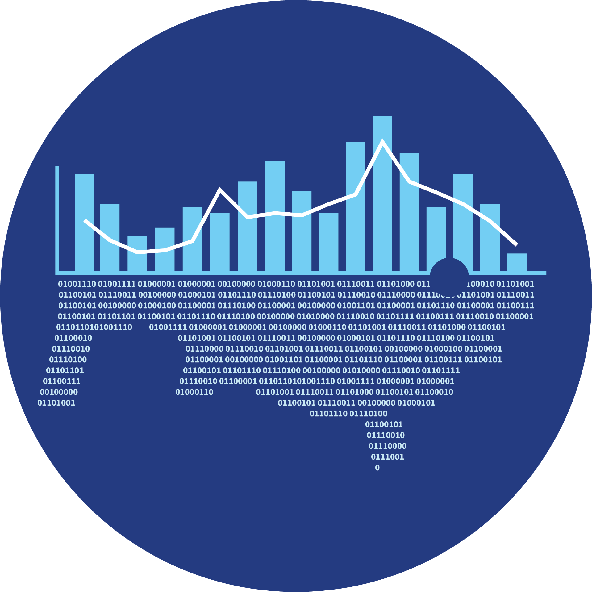

::: {.d-flex .justify-content-between .align-items-center .mb-4}
{width="320"}

{width="160" style="border-radius: 50%;"}
:::

The primary mission of the Enterprise Data Management (EDM) Program is to rigorously apply modern data management best practices to improve business and scientific operations throughout NOAA Fisheries.

::: {.team-section}
## Our Vision and Mission

**Vision** - All of our data are governed under a consistent system of rules, processes, policies, and roles that ensures our data is managed, documented, secured, and easily accessed and used throughout its lifecycle.

**Mission** - To drive enterprise data management and governance for NOAA Fisheries by providing expert support, promoting standardized data practices, and aligning with strategic initiatives to save resources, simplify workflows, and empower the Fisheries Data Governance Committee.

### Our Goals
- Enhance data integrity and reliability to support accurate analysis, research, and policy formulation.
- Improve data accessibility and sharing to facilitate collaboration and maximize the impact of scientific research.
- Establish an organizational culture of data excellence rooted in Open Science by implementing robust, responsible data management practices that prioritize transparency, reproducibility, and collaborative discovery.
- We strive for data excellence, enabling us to deliver exceptional products/services exceeding customer expectations.
- Establish a sustainable and adaptive data governance framework that evolves with advanced technologies and evolving data needs.
:::

::: {.team-section}
## Focus Areas

| # | Theme | Description |
|---|---|---|
| 01 | **ACDO Support** | Supporting the work of the Fisheries Assistant Chief Data Officer (ACDO)|
| 02 | **Data Governance** | Focusing on Fisheries enterprise data governance, data optimization, metadata, and data centralization and integration |
| 03 | **FDGC Support** | Supporting the Fisheries Data Governance Committee (FDGC) |
:::

::: {.team-section}
## Recent News

**September 2026** — NEWS.
:::

::: {.team-section}
## Affiliation

The EDM Program is based in the **Science Information Division - Office of Science and Technology** at NOAA Fisheries.
:::

::: {.callout-note}
**Looking for domain-specific resources?** See the [Data Domains](domains.qmd) and [Active Projects](projects.qmd) pages.
:::