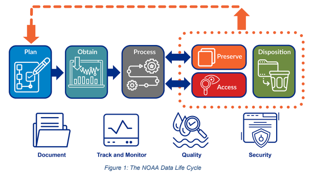

Understanding the data lifecycle is foundational to good science. Every stage — from planning through reuse — has implications for the quality, reproducibility, and long-term value of your data.

------------------------------------------------------------------------

## Why Data Management Matters

Good data management is not just a compliance requirement — it is what makes science trustworthy, reproducible, and useful beyond a single project.

| Framework | What it requires | Why it matters to you |
|------------------------|------------------------|------------------------|
| **FAIR Data Principles** | Data must be Findable, Accessible, Interoperable, and Reusable | Extends the scientific value of your work; enables others to build on it |
| **OSTP Open Science Memo (2022)** | Federally funded research data must be publicly accessible by default | NOAA data is a public asset — it must be managed well enough to share |
| **Evidence Act (2018)** | Federal data must be available for future evidence-building and policy | Data collected with federal resources must be reusable, not just stored |
| **Information Quality Act (IQA)** | Disseminated data must meet documented quality and objectivity standards | Lifecycle practices — versioning, QC, documentation — are how you comply |
| **Gold Standard Science** | Results must be peer-reviewed, reproducible, and transparently documented | Data lifecycle management is how you operationalize this commitment |

------------------------------------------------------------------------

## The Data Lifecycle

The NOAA Data Life Cycle model (Figure 1, NAO 212-15B Data Management Handbook) provides the official framework for managing NOAA data as a strategic asset. It consists of six primary components and four cross-cutting components that apply throughout.

{fig-alt="Flowchart showing the NOAA Data Life Cycle. Six primary stages connected left to right: Plan, Obtain, Process, Preserve, Access, and Disposition. A feedback loop arrow returns from Disposition to Plan. Below are four cross-cutting components: Document, Track and Monitor, Quality, and Security." width="100%"}

*Figure 1: The NOAA Data Life Cycle. Source: [NAO 212-15B Data Management Handbook](https://www.noaa.gov/sites/default/files/2025-03/NAO_212-15B_-_Data_Management_Handbook.pdf).*

**Select a stage below** to explore what it involves, what outputs it produces, and how it connects to federal requirements and open science principles. These stages follow the official NOAA Data Life Cycle model from NAO 212-15B.

```{=html}
<style>
/* ── Lifecycle widget ── */
#lifecycle-widget {
  font-family: 'Source Sans 3', 'Segoe UI', sans-serif;
  margin: 2rem 0 3rem;
}

/* ── Stage track ── */
.lc-track {
  display: flex;
  align-items: stretch;
  gap: 0;
  border-radius: 8px;
  overflow: hidden;
  box-shadow: 0 2px 12px rgba(0,48,135,0.10);
  border: 1px solid #dde3ea;
}

.lc-stage {
  flex: 1;
  display: flex;
  flex-direction: column;
  align-items: center;
  justify-content: center;
  padding: 1.1rem 0.5rem 1rem;
  background: #f5f7fa;
  cursor: pointer;
  border: none;
  border-right: 1px solid #dde3ea;
  transition: background 0.18s, color 0.18s;
  position: relative;
  gap: 0.5rem;
  /* 508 */
  color: #1a1a2e;
}
.lc-stage:last-child { border-right: none; }

/* Arrow connector */
.lc-stage:not(:last-child)::after {
  content: '';
  position: absolute;
  right: -10px;
  top: 50%;
  transform: translateY(-50%);
  width: 0; height: 0;
  border-top: 10px solid transparent;
  border-bottom: 10px solid transparent;
  border-left: 10px solid #dde3ea;
  z-index: 2;
  pointer-events: none;
}
.lc-stage:not(:last-child).active::after {
  border-left-color: #003087;
}

.lc-stage:hover {
  background: #e8eff8;
}
.lc-stage.active {
  background: #003087;
  color: #fff;
}
/* 508: visible focus ring */
.lc-stage:focus-visible {
  outline: 3px solid #FFD700;
  outline-offset: -3px;
  z-index: 3;
}

.lc-icon {
  font-size: 1.4rem;
  line-height: 1;
  /* 508: aria-hidden on the span in HTML */
}
.lc-num {
  font-size: 0.6rem;
  font-weight: 700;
  letter-spacing: 0.1em;
  text-transform: uppercase;
  opacity: 0.6;
}
.lc-stage.active .lc-num { opacity: 0.8; color: #7dcfff; }
.lc-label {
  font-size: 0.78rem;
  font-weight: 700;
  text-align: center;
  line-height: 1.25;
  letter-spacing: 0.01em;
}
.lc-stage.active .lc-label { color: #fff; }

/* ── Detail panel ── */
.lc-detail {
  margin-top: 0;
  border: 1px solid #dde3ea;
  border-top: 3px solid #003087;
  border-radius: 0 0 8px 8px;
  background: #fff;
  overflow: hidden;
  /* Animate open */
  max-height: 0;
  opacity: 0;
  transition: max-height 0.35s cubic-bezier(0.4,0,0.2,1), opacity 0.25s ease;
}
.lc-detail.open {
  max-height: 800px;
  opacity: 1;
}
.lc-detail-inner {
  padding: 1.75rem 2rem 2rem;
}

.lc-detail-header {
  display: flex;
  align-items: center;
  gap: 1rem;
  margin-bottom: 1.25rem;
  padding-bottom: 1rem;
  border-bottom: 1px solid #e5e7eb;
}
.lc-detail-icon {
  font-size: 2rem;
  flex-shrink: 0;
}
.lc-detail-title {
  font-size: 1.15rem;
  font-weight: 700;
  color: #003087;
  margin: 0 0 0.15rem;
}
.lc-detail-subtitle {
  font-size: 0.82rem;
  color: #595f6b;
  margin: 0;
  font-style: italic;
}

/* Policy tag pills */
.lc-tags {
  display: flex;
  flex-wrap: wrap;
  gap: 0.4rem;
  margin-bottom: 1.25rem;
}
.lc-tag {
  font-size: 0.7rem;
  font-weight: 600;
  padding: 0.2rem 0.6rem;
  border-radius: 3px;
  letter-spacing: 0.03em;
  background: #eff6ff;
  color: #003087;
  border: 1px solid #bfdbfe;
}

/* Detail table */
.lc-table {
  width: 100%;
  border-collapse: collapse;
  font-size: 0.875rem;
}
.lc-table th {
  background: #f5f7fa;
  color: #003087;
  font-size: 0.72rem;
  font-weight: 700;
  text-transform: uppercase;
  letter-spacing: 0.07em;
  padding: 0.6rem 0.85rem;
  text-align: left;
  border-bottom: 2px solid #dde3ea;
}
.lc-table td {
  padding: 0.65rem 0.85rem;
  border-bottom: 1px solid #f3f4f6;
  color: #1a1a2e;
  vertical-align: top;
  line-height: 1.55;
}
.lc-table td:first-child {
  font-weight: 600;
  color: #003087;
  white-space: nowrap;
  width: 30%;
}
.lc-table tr:last-child td { border-bottom: none; }

/* Callout tip inside widget */
.lc-tip {
  background: #f0f9ff;
  border-left: 3px solid #0085CA;
  border-radius: 0 4px 4px 0;
  padding: 0.75rem 1rem;
  font-size: 0.85rem;
  color: #1a1a2e;
  margin-top: 1rem;
  line-height: 1.6;
}
.lc-tip strong { color: #003087; }

/* ── Dark mode ── */
[data-bs-theme="dark"] .lc-track { border-color: #2d3448; box-shadow: 0 2px 12px rgba(0,0,0,0.3); }
[data-bs-theme="dark"] .lc-stage { background: #1e2537; color: #c9d1d9; border-right-color: #2d3448; }
[data-bs-theme="dark"] .lc-stage::after { border-left-color: #2d3448; }
[data-bs-theme="dark"] .lc-stage.active::after { border-left-color: #0085CA; }
[data-bs-theme="dark"] .lc-stage:hover { background: #252d42; }
[data-bs-theme="dark"] .lc-stage.active { background: #0085CA; color: #fff; }
[data-bs-theme="dark"] .lc-detail { background: #1a1f2e; border-color: #2d3448; border-top-color: #0085CA; }
[data-bs-theme="dark"] .lc-detail-title { color: #7dcfff; }
[data-bs-theme="dark"] .lc-detail-subtitle { color: #8b949e; }
[data-bs-theme="dark"] .lc-table th { background: #141824; color: #7dcfff; border-bottom-color: #2d3448; }
[data-bs-theme="dark"] .lc-table td { color: #c9d1d9; border-bottom-color: #2d3448; }
[data-bs-theme="dark"] .lc-table td:first-child { color: #7dcfff; }
[data-bs-theme="dark"] .lc-detail-header { border-bottom-color: #2d3448; }
[data-bs-theme="dark"] .lc-tag { background: #1e2d45; color: #7dcfff; border-color: #2d4a6b; }
[data-bs-theme="dark"] .lc-tip { background: #0d1f2d; border-left-color: #0085CA; color: #c9d1d9; }
[data-bs-theme="dark"] .lc-tip strong { color: #7dcfff; }
[data-bs-theme="dark"] .lc-num { color: #7dcfff; }

/* ── Responsive: stack vertically on small screens ── */
@media (max-width: 640px) {
  .lc-track { flex-direction: column; }
  .lc-stage { flex-direction: row; justify-content: flex-start; padding: 0.85rem 1.25rem; gap: 0.75rem; border-right: none; border-bottom: 1px solid #dde3ea; }
  .lc-stage:not(:last-child)::after { display: none; }
  .lc-label { text-align: left; }
  [data-bs-theme="dark"] .lc-stage { border-bottom-color: #2d3448; }
}
</style>

<div id="lifecycle-widget" role="region" aria-label="Interactive data lifecycle explorer">

  <!-- Stage selector track -->
  <div class="lc-track" role="tablist" aria-label="Data lifecycle stages">

    <button class="lc-stage" id="lc-tab-1" role="tab"
            aria-selected="false" aria-controls="lc-panel-1"
            data-stage="1" tabindex="0">
      <span class="lc-num" aria-hidden="true">01</span>
      <span class="lc-icon" aria-hidden="true">📋</span>
      <span class="lc-label">Plan</span>
    </button>

    <button class="lc-stage" id="lc-tab-2" role="tab"
            aria-selected="false" aria-controls="lc-panel-2"
            data-stage="2" tabindex="-1">
      <span class="lc-num" aria-hidden="true">02</span>
      <span class="lc-icon" aria-hidden="true">🔬</span>
      <span class="lc-label">Collect & Create</span>
    </button>

    <button class="lc-stage" id="lc-tab-3" role="tab"
            aria-selected="false" aria-controls="lc-panel-3"
            data-stage="3" tabindex="-1">
      <span class="lc-num" aria-hidden="true">03</span>
      <span class="lc-icon" aria-hidden="true">⚙️</span>
      <span class="lc-label">Process & Analyze</span>
    </button>

    <button class="lc-stage" id="lc-tab-4" role="tab"
            aria-selected="false" aria-controls="lc-panel-4"
            data-stage="4" tabindex="-1">
      <span class="lc-num" aria-hidden="true">04</span>
      <span class="lc-icon" aria-hidden="true">📤</span>
      <span class="lc-label">Share & Publish</span>
    </button>

    <button class="lc-stage" id="lc-tab-5" role="tab"
            aria-selected="false" aria-controls="lc-panel-5"
            data-stage="5" tabindex="-1">
      <span class="lc-num" aria-hidden="true">05</span>
      <span class="lc-icon" aria-hidden="true">🗄️</span>
      <span class="lc-label">Preserve</span>
    </button>

    <button class="lc-stage" id="lc-tab-6" role="tab"
            aria-selected="false" aria-controls="lc-panel-6"
            data-stage="6" tabindex="-1">
      <span class="lc-num" aria-hidden="true">06</span>
      <span class="lc-icon" aria-hidden="true">♻️</span>
      <span class="lc-label">Reuse</span>
    </button>

  </div>

  <!-- Detail panels -->
  <div class="lc-detail" id="lc-panel-1" role="tabpanel" aria-labelledby="lc-tab-1" hidden>
    <div class="lc-detail-inner">
      <div class="lc-detail-header">
        <span class="lc-detail-icon" aria-hidden="true">📋</span>
        <div>
          <div class="lc-detail-title">Plan</div>
          <div class="lc-detail-subtitle">Define your data strategy before collection begins</div>
        </div>
      </div>
      <div class="lc-tags">
        <span class="lc-tag">Evidence Act</span>
        <span class="lc-tag">FAIR</span>
        <span class="lc-tag">OTHER TAG</span>
      </div>
      <table class="lc-table">
  <thead><tr><th scope="col">Output</th><th scope="col">Description</th></tr></thead>
  <tbody>
    <tr><td>Data Management Plan</td><td>Documents storage, sharing, quality, and preservation intentions. Required by NSF, NIH, and NOAA.</td></tr>
    <tr><td>SOMETHING</td><td>some materials that come from the plan step</td></tr>
    <tr><td>SOMETHING</td><td>some materials that come from the plan step</td></tr>
  </tbody>
</table>
      <div class="lc-tip"><strong>Tip:</strong> CANNED LANGUAGE A well-written DMP saves significant time and cost downstream. Planning for FAIR and open data from the start costs far less than retrofitting it at the end of a project.</div>
    </div>
  </div>

  <div class="lc-detail" id="lc-panel-2" role="tabpanel" aria-labelledby="lc-tab-2" hidden>
    <div class="lc-detail-inner">
      <div class="lc-detail-header">
        <span class="lc-detail-icon" aria-hidden="true">🔬</span>
        <div>
          <div class="lc-detail-title">Collect & Create</div>
          <div class="lc-detail-subtitle">Capture data with consistency and documentation from day one</div>
        </div>
      </div>
      <div class="lc-tags">
        <span class="lc-tag">IQA</span>
        <span class="lc-tag">Gold Standard Science</span>
        <span class="lc-tag">Other Tag</span>
      </div>
      <table class="lc-table">
  <thead><tr><th scope="col">Best practice</th><th scope="col">Why it matters</th></tr></thead>
  <tbody>
    <tr><td>Standardized file naming</td><td>Prevents ambiguity and enables automated processing downstream.</td></tr>
    <tr><td>Version control from day one</td><td>Tracks changes; prevents the "final_FINAL_v3" problem.</td></tr>
    <tr><td>Other Best Practice</td><td>Why do best practices matter? idk?</td></tr>
    <tr><td>Other Best Practice</td><td>Why do best practices matter? idk?</td></tr>
  </tbody>
</table>
      <div class="lc-tip"><strong>Some note or tip:</strong> Tip about doing better.</div>
    </div>
  </div>

  <div class="lc-detail" id="lc-panel-3" role="tabpanel" aria-labelledby="lc-tab-3" hidden>
    <div class="lc-detail-inner">
      <div class="lc-detail-header">
        <span class="lc-detail-icon" aria-hidden="true">⚙️</span>
        <div>
          <div class="lc-detail-title">Process & Analyze</div>
          <div class="lc-detail-subtitle">Use documented, reproducible workflows</div>
        </div>
      </div>
      <div class="lc-tags">
        <span class="lc-tag">Gold Standard Science</span>
        <span class="lc-tag">Other Tag</span>
        <span class="lc-tag">Open Science</span>
      </div>
      <table class="lc-table">
  <thead><tr><th scope="col">Do</th><th scope="col">Avoid</th></tr></thead>
  <tbody>
    <tr><td>Scripted pipelines (R, Python)</td><td>Manual edits in Excel with no change log</td></tr>
    <tr><td>Git version control for all code</td><td>Emailing scripts back and forth</td></tr>
    <tr><td>Separate raw and processed data</td><td>Overwriting raw data files</td></tr>
    <tr><td>Other things folks should do</td><td>something you shouldn't do</td></tr>
  </tbody>
</table>
      <div class="lc-tip"><strong>Tips:</strong> something about being better</div>
    </div>
  </div>

  <div class="lc-detail" id="lc-panel-4" role="tabpanel" aria-labelledby="lc-tab-4" hidden>
    <div class="lc-detail-inner">
      <div class="lc-detail-header">
        <span class="lc-detail-icon" aria-hidden="true">📤</span>
        <div>
          <div class="lc-detail-title">Share & Publish</div>
          <div class="lc-detail-subtitle">Deposit data with complete metadata and a persistent identifier</div>
        </div>
      </div>
      <div class="lc-tags">
        <span class="lc-tag">OPEN Government Data Act</span>
        <span class="lc-tag">Other Tag</span>
        <span class="lc-tag">Evidence Act</span>
      </div>
      <table class="lc-table">
  <thead><tr><th scope="col">Repository type</th><th scope="col">Examples</th><th scope="col">Best for</th></tr></thead>
  <tbody>
    <tr><td>NOAA-specific</td><td>NCEI, InPort</td><td>NOAA observational and environmental data</td></tr>
    <tr><td>Generalist</td><td>Zenodo, KNB, BCO-DMO, Mendeley, OBIS, Movebank</td><td>Data repositories that accept data from individual scientists regardless of data type, format, content, or disciplinary focus.</td></tr>
    <tr><td>Other Repositories</td><td>List</td><td>Usage</td></tr>
    <tr><td>NOAA Grantees</td><td>OSF, Pangea, Figshare, Dryad</td><td>Federal employees are not able to agree to the specific terms and conditions of these repositories, however, NOAA grantees may wish to consult their institution's council for additional guidance.</td></tr>
  </tbody>
</table>
      <div class="lc-tip"><strong>Open science mandate:</strong> Data sharing is required under the OPEN Government Data Act and OSTP memo. Data with a DOI and complete metadata is FAIR data. Data buried in a file share is not.</div>
    </div>
  </div>

  <div class="lc-detail" id="lc-panel-5" role="tabpanel" aria-labelledby="lc-tab-5" hidden>
    <div class="lc-detail-inner">
      <div class="lc-detail-header">
        <span class="lc-detail-icon" aria-hidden="true">🗄️</span>
        <div>
          <div class="lc-detail-title">Preserve</div>
          <div class="lc-detail-subtitle">Ensure data remains accessible and usable long-term</div>
        </div>
      </div>
      <div class="lc-tags">
        <span class="lc-tag">Evidence Act</span>
        <span class="lc-tag">Other Tag</span>
        <span class="lc-tag">Other Tag</span>
      </div>
      <table class="lc-table">
  <thead><tr><th scope="col">Preferred format?</th><th scope="col">Avoid</th></tr></thead>
  <tbody>
    <tr><td>CSV, TSV (tabular)</td><td>XLS, XLSX</td></tr>
    <tr><td>NetCDF, HDF5 (gridded/array)</td><td>Proprietary binary formats</td></tr>
    <tr><td>GeoTIFF, GeoPackage (spatial)</td><td>Vendor-locked GIS formats</td></tr>
    <tr><td>Plain text, Markdown (docs)</td><td>Word documents as primary records</td></tr>
  </tbody>
</table>
      <div class="lc-tip"><strong>Evidence Act:</strong> Data must remain available for future evidence-building. Data that cannot be read in 10 years has no long-term scientific or policy value.</div>
    </div>
  </div>

  <div class="lc-detail" id="lc-panel-6" role="tabpanel" aria-labelledby="lc-tab-6" hidden>
    <div class="lc-detail-inner">
      <div class="lc-detail-header">
        <span class="lc-detail-icon" aria-hidden="true">♻️</span>
        <div>
          <div class="lc-detail-title">Reuse</div>
          <div class="lc-detail-subtitle">Discover, cite, and build on existing datasets responsibly</div>
        </div>
      </div>
      <div class="lc-tags">
        <span class="lc-tag">Other Tag</span>
        <span class="lc-tag">Open Science</span>
        <span class="lc-tag">Other Tag</span>
      </div>
      <table class="lc-table">
  <thead><tr><th scope="col">Action</th><th scope="col">How</th></tr></thead>
  <tbody>
    <tr><td>Cite datasets</td><td>Use the DOI or persistent identifier; include version number</td></tr>
    <tr><td>Document changes</td><td>Record what was changed from the original and why</td></tr>
    <tr><td>Idk?</td><td>how to do the thing</td></tr>
    <tr><td>Idk?</td><td>how to do the thing</td></tr>
  </tbody>
</table>
      <div class="lc-tip"><strong>Tips:</strong> Just reuse.</div>
    </div>
  </div>

</div>

<script>
document.addEventListener('DOMContentLoaded', function() {
  const tabs = Array.from(document.querySelectorAll('.lc-stage[role="tab"]'));
  const panels = Array.from(document.querySelectorAll('.lc-detail[role="tabpanel"]'));
  let current = -1;

  function activate(idx, moveFocus, userInitiated) {
    if (current === idx) {
      tabs[idx].classList.remove('active');
      tabs[idx].setAttribute('aria-selected', 'false');
      panels[idx].classList.remove('open');
      panels[idx].hidden = true;
      current = -1;
      return;
    }

    if (current >= 0) {
      tabs[current].classList.remove('active');
      tabs[current].setAttribute('aria-selected', 'false');
      tabs[current].setAttribute('tabindex', '-1');
      panels[current].classList.remove('open');
      const prev = panels[current];
      setTimeout(() => { if (!prev.classList.contains('open')) prev.hidden = true; }, 350);
    }

    tabs[idx].classList.add('active');
    tabs[idx].setAttribute('aria-selected', 'true');
    tabs[idx].setAttribute('tabindex', '0');
    panels[idx].hidden = false;
    panels[idx].getBoundingClientRect();
    panels[idx].classList.add('open');
    current = idx;

    if (moveFocus) tabs[idx].focus();

    // Only scroll into view if the user manually clicked a tab, NOT on page load
    if (userInitiated) {
      setTimeout(() => {
        panels[idx].scrollIntoView({ behavior: 'smooth', block: 'nearest' });
      }, 50);
    }
  }

  tabs.forEach((tab, idx) => {
    // Pass true for userInitiated on manual click or key press
    tab.addEventListener('click', () => activate(idx, false, true));
    tab.addEventListener('keydown', (e) => {
      let next = -1;
      if (e.key === 'ArrowRight') next = (idx + 1) % tabs.length;
      if (e.key === 'ArrowLeft')  next = (idx - 1 + tabs.length) % tabs.length;
      if (e.key === 'Home')       next = 0;
      if (e.key === 'End')        next = tabs.length - 1;
      if (e.key === 'Enter' || e.key === ' ') { e.preventDefault(); activate(idx, true, true); }
      if (next >= 0) {
        e.preventDefault();
        tabs[next].setAttribute('tabindex', '0');
        tabs[next].focus();
        tab.setAttribute('tabindex', '-1');
      }
    });
  });

  // Open first stage by default without scrolling the page down
  activate(0, false, false);
});
</script>
```

------------------------------------------------------------------------

## Data Domains

Every NOAA Fisheries area has its own data formats, quality standards, and archival requirements. Visit the [Data Domains](domains.html) tab for field-specific GitHub repositories, templates, and guidance organized by science area.
